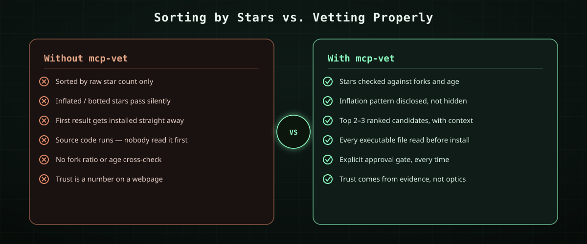
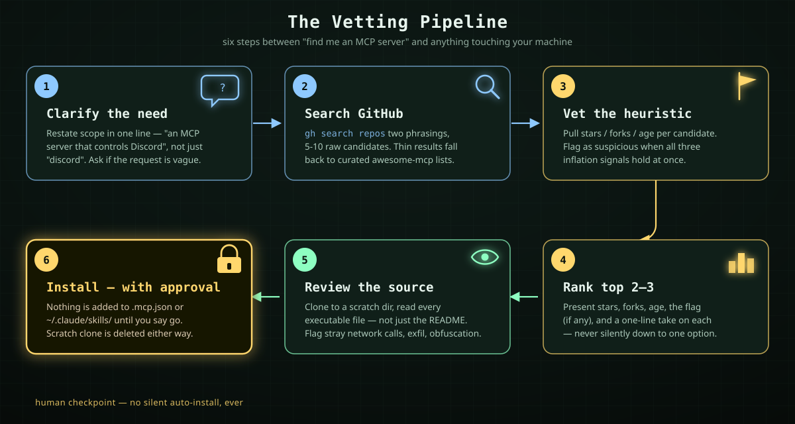
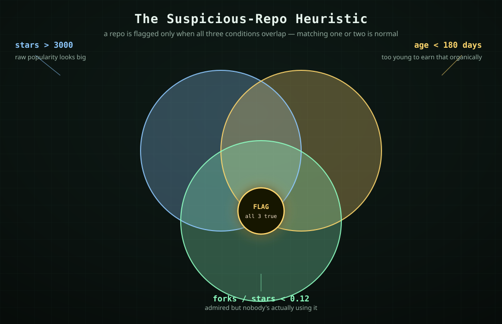

<div align="center">

[](LICENSE)
[](https://claude.com/claude-code)
[](https://modelcontextprotocol.io)
[](#-install)
[](#)

</div>

<p align="center"><i>Bir hobi projesi. Yıldız sayısına değil, koda bakıyoruz.</i></p>

## What is this

`mcp-vet` is a [Claude Code](https://claude.com/claude-code) **skill** — a `SKILL.md` file, no app, no UI, no daemon — that changes how Claude looks for MCP (Model Context Protocol) servers on your behalf.

Most "find me an MCP server" workflows stop at discovery: search, sort by stars, install the top hit. That's the whole failure mode this project exists to interrupt. **Star count is a number anyone can inflate**, and installing an MCP server means running someone else's code with access to your tools, your files, and whatever credentials you hand it. `mcp-vet` inserts two steps that discovery alone skips:

| | |
|---|---|
| 📊 **Vets the popularity signal** | Flags repos whose star count looks inflated relative to their fork count and age, instead of trusting raw stars. |
| 🕵️ **Reads the source before install** | Clones the candidate to a scratch directory and reads the actual executable code — not just the README — before anything is added to your setup. |
| 🚦 **Never installs blind** | Nothing gets added to `.mcp.json` or `~/.claude/skills/` without an explicit approval step from you. |

---

## 📚 Table of contents

- [Why this exists](#-why-this-exists)
- [The vetting pipeline](#-the-vetting-pipeline)
- [The suspicious-repo heuristic](#-the-suspicious-repo-heuristic)
- [Install](#-install)
- [Usage](#-usage)
- [What this skill deliberately does not do](#-what-this-skill-deliberately-does-not-do)
- [Philosophy](#-philosophy)
- [License](#-license)

---

## 🤔 Why this exists

GitHub stars are the default trust signal everyone reaches for — "12k stars, must be legit." But stars can be bought, bot-farmed, or bootstrapped by a launch-day post that never converts into real usage. None of that shows up if you only look at one number.

The signal that's harder to fake is the **relationship between stars, forks, and age**. A genuinely useful tool accumulates forks (people actually building on it) roughly in proportion to how long it's been around. A repo with a huge star count, barely any forks, and a couple of months of history is a pattern worth a second look — not a verdict, a flag.

<p align="center"></p>

---

## 🔀 The vetting pipeline

This is the whole value proposition in one picture — six steps, in order, none of them skippable even when a candidate looks obviously fine.

<p align="center"></p>

| Step | What happens |
|---|---|
| 1. **Clarify** | The need gets restated in one line before any search runs — "an MCP server that controls Discord," not just "discord." Vague requests get one clarifying question instead of a guess. |
| 2. **Search** | `gh search repos "<need> mcp"` and `"<need> mcp server"` as a second phrasing. Thin results (under ~3 real candidates) fall back to the major curated lists (`punkpeye`, `appcypher`, `wong2` awesome-mcp-servers). At least 5–10 raw candidates get pulled before filtering. |
| 3. **Vet** | Every candidate gets `stargazers_count`, `forks_count`, `created_at`, `pushed_at`, `archived`, and `license` pulled via `gh api`. The suspicious heuristic runs here — see below. |
| 4. **Rank** | Top 2–3 candidates get presented with stars, forks, age, the flag (if any), and a one-line recommendation each. Never silently narrowed to a single option unless the search genuinely returned only one real candidate. |
| 5. **Review** | The candidate you pick gets cloned to a **scratch directory** — never straight into `.mcp.json` or your skills folder. Every executable file gets read, not just the README. Network calls to unrelated hosts, credential/env-var exfiltration, obfuscated source, and suspicious install-time scripts all get called out explicitly. |
| 6. **Install** | Only after you say go. MCP servers go into the workspace `.mcp.json`; skills go into `~/.claude/skills/` or `.claude/skills/` depending on scope. The scratch clone gets deleted either way — reviewed-and-rejected or reviewed-and-installed. |

There's a quiet seventh step: if the same category of need comes up again later (e.g. "MCP servers for video editing"), the shortlist gets noted in memory so it isn't rediscovered from scratch — but star/fork counts always get re-verified live, since a memory snapshot goes stale and the numbers change.

---

## ⚖️ The suspicious-repo heuristic

A repo is flagged as **suspicious** only when **all three** of these hold *at the same time*. Matching one or two is normal and not flagged — plenty of legitimate, fast-growing, official-org projects trip a single condition.

<p align="center"></p>

```text
IF  stars > 3000
AND age   < 180 days
AND forks / stars < 0.12
THEN flag as suspicious (not disqualified — disclosed)
```

This is a **disclosed flag, not a hard filter**. A young, official-org repo can legitimately blow up fast. The point isn't to auto-reject it — it's to make sure that pattern surfaces explicitly instead of being silently absorbed into a stars-sorted recommendation you'd otherwise never question.

Beyond the hard heuristic, a few secondary signals get weighed together (no hard cutoff on any of these individually):

| Signal | What it tells you |
|---|---|
| `pushed_at` | Recently maintained vs. no commits in 6+ months (stale) |
| README quality | Real usage docs vs. a marketing blurb with no substance |
| License present | Missing license is a legal yellow flag for reuse — not a safety one |
| Archived status | Archived repos are deprioritized regardless of star count |

---

## 📥 Install

Copy `SKILL.md` into your Claude Code skills directory:

```bash
mkdir -p ~/.claude/skills/mcp-vet
cp SKILL.md ~/.claude/skills/mcp-vet/
```

Or drop it into a single project's `.claude/skills/mcp-vet/` for project-only scope instead of installing it globally.

That's the entire install. No dependencies, no build step, no config file — it's one Markdown file that Claude Code reads as a skill definition.

---

## 💬 Usage

Once installed, the skill triggers automatically on requests shaped like these — nothing extra to invoke:

- `"Is there an MCP server for Discord?"`
- `"Find me an MCP server that can control OBS."`
- `"I need an MCP for X — find and vet one, don't just install the first result."`
- `"kur mcp"` / `"hangi MCP var"` / `"bana bir MCP bul"` — Turkish phrasing works too.

Claude walks the six-step pipeline above, shows you the ranked candidates with their vetting summary, and stops before touching your setup until you pick one and approve it.

---

## 🚫 What this skill deliberately does not do

- Does **not** auto-install anything without showing you the vetting summary first.
- Does **not** treat a high star count as sufficient on its own — the entire premise is that star count can be gamed.
- Does **not** recommend paid or credentialed integrations without flagging the cost or credential requirement up front.

---

## 🧭 Philosophy

The MCP ecosystem is young enough that "popular" and "safe" haven't been pulled apart yet — most tooling still treats them as the same thing. They aren't. A star count measures attention; it says nothing about whether the code behind it does what the README claims.

`mcp-vet` doesn't try to replace your judgment with an automated verdict. It tries to make sure you're judging with the right evidence in front of you: real popularity signals instead of one gameable number, and the actual source instead of marketing copy. The heuristic flags, it doesn't reject. The review reads, it doesn't auto-approve. The install waits for you, every time.

*Küçük bir araç, ama prensip net: kurmadan önce oku, güvenmeden önce doğrula.*
*(A small tool, but the principle is simple: read before you install, verify before you trust.)*

---

## 📄 License

MIT — see [LICENSE](LICENSE).
